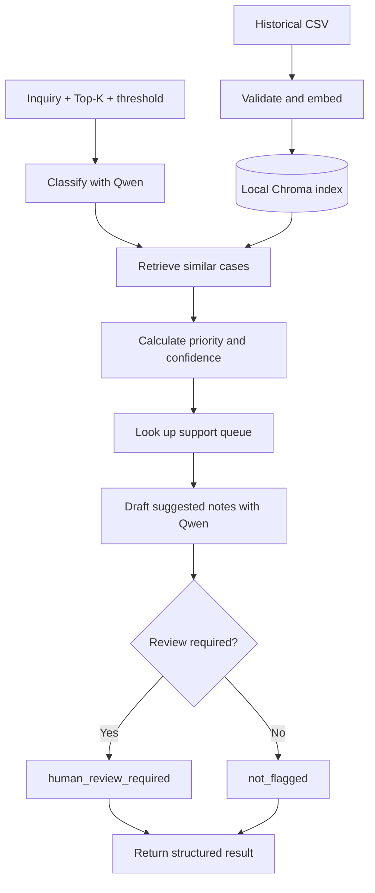

# Architecture and code guide

This guide describes the submitted prototype's current behavior and design trade-offs. For installation and execution, see the [main README](../README.md).

## Architecture

Historical inquiries are embedded during ingestion. Each new inquiry then runs through a fixed LangGraph workflow with two chat-model calls: classification and resolution drafting.



LangGraph provides shared state, explicit processing steps, and a conditional review branch. It satisfies the assignment and makes intermediate results inspectable. Plain Python could also implement this sequence; this is a predefined workflow, not an autonomous agent selecting tools.

LangChain supplies the model, embedding, document, and vector-store interfaces. Priority, confidence, and queue selection are ordinary Python logic.

## Module responsibilities

| Module | Main entry points | Responsibility |
| --- | --- | --- |
| [main.py](../src/main.py) | `triage_inquiry()`, `main()` | Backend entry point for the UI; CLI displays node updates and final state. |
| [workflow.py](../src/workflow.py) | `TriageState`, `make_initial_state()`, `build_graph()` | Defines inputs, state, nodes, execution order, and the review branch. |
| [classify.py](../src/classify.py) | `Classification`, `classify_inquiry()` | Sends the inquiry and full taxonomy descriptions to Qwen; validates category and reason. |
| [knowledge_base.py](../src/knowledge_base.py) | `NomicEmbeddings`, `load_cases()`, `get_store()`, `build_index()`, `retrieve_cases()` | Loads the CSV, applies embedding prefixes, persists cases, and returns Top-K matches. |
| [decisions.py](../src/decisions.py) | `assess_evidence()`, `route_category()` | Computes priority votes, confidence, review reasons, and the queue mapping. |
| [resolution.py](../src/resolution.py) | `ResolutionDraft`, `draft_resolution()` | Generates one or two suggested next-action notes from the inquiry and context. |
| [inspect_data.py](../src/inspect_data.py) | `main()` | Validates required fields and labels; prints category, priority, and queue distributions. |
| [check_embeddings.py](../src/check_embeddings.py) | `cosine_similarity()`, `main()` | Standalone three-document embedding exercise; not part of the application workflow. |
| [app.py](../app/app.py) | `triage_inquiry()`, `render_result()` | Connects Streamlit to the backend and displays results, errors, and session history. |

## Data and model choices

The knowledge base contains **300 cases in eight categories**, with **146 low, 100 medium, and 54 high** priority labels. Each category maps to one queue.

Validation checks required columns, nonblank values, unique IDs, allowed labels, and consistent queue mappings. It checks structure, not the correctness of every historical label. The taxonomy includes overlapping boundaries, such as service-related invoice questions.

| Choice | Rationale | Trade-off |
| --- | --- | --- |
| Ollama with `qwen3:4b` | An available lightweight local model supports both chat tasks without a hosted inference API key. | Limited instruction following and answer quality. |
| `nomic-embed-text:latest` | 768-dimensional embeddings support similarity retrieval beyond exact words. | Related language does not guarantee equivalent intent or urgency. |
| Persistent Chroma | Simple local storage for a small dataset; retrieved evidence remains inspectable. | Model/preprocessing changes require deliberate index versioning. |
| Pydantic structured output | Restricts category values and the shape of generated notes. | Valid structure does not establish semantic correctness. |

Both chat calls use temperature `0`, thinking disabled, `num_predict=512`, and a 120-second client timeout. These are baseline settings, not proven optimal settings. Disabling thinking keeps the short structured calls within a modest output budget; an exploratory thinking-enabled run reached the limit.

## Processing decisions

### Ingestion and retrieval

Each short inquiry is one document, with no further chunking. Only inquiry text is embedded; case ID, category, priority, and queue are metadata. Nomic receives `search_document:` for historical text and `search_query:` for new inquiries.

Ingestion validates the CSV, adds records in batches of 32 using stable case IDs, and checks that stored IDs match the source. The index persists under `.chroma/`; a CSV hash is included in the collection name. Changes to model weights behind the same tag are not automatically detected.

Retrieval searches across all categories and returns the requested Top-K. Chroma uses cosine distance; the application exposes `cosine_similarity = 1 - cosine_distance`. Searching globally preserves evidence that disagrees with the classifier, but may return irrelevant neighbours. An exact inquiry can score below 1 because query and document inputs use different prefixes.

### Classification and routing

Classification uses the inquiry and full taxonomy descriptions before retrieval. It does not classify by keyword counts or use retrieved labels in this first model call.

The validated category determines the queue through the CSV mapping. A conflicting or missing mapping raises an error. This avoids generated team names, but routing still depends on the category being correct. No ticket is actually sent to another system.

### Priority

Only retrieved cases matching the predicted category and having positive similarity contribute. Their similarities are clipped to [0, 1] and added to the corresponding priority's total. The highest total wins; an exact tie favors the higher priority.

This gives an inspectable decision based on historical cases and limits influence from other categories. However, several weaker matches can outweigh one highly relevant case. A category match also does not establish matching urgency.

If there is no positive matching evidence, priority becomes a `medium` placeholder and `priority_is_provisional=True`. This always requires review. A false provisional flag merely means evidence was available.

The decision function does not read the original inquiry. **Explicit urgency, negation, and insufficient-information handling are current limitations**, not implemented safeguards.

### Confidence and escalation

For each retrieved case, let `w_i = clip(similarity_i, 0, 1)`:

```text
S = mean weight across all retrieved cases
A = positive-weight matching-category cases / total retrieved cases
P = winning priority weight / total matching-category weight

confidence = S * A * P
```

Without matching positive evidence, `P=0`. Empty retrieval also produces zero confidence.

**Illustrative calculation**, assuming classification is billing:

| Retrieved category | Priority | Weight |
| --- | --- | ---: |
| billing | high | 0.80 |
| billing | high | 0.70 |
| service | low | 0.60 |

The billing cases select high priority. `S=0.70`, `A=2/3`, and `P=1`, so confidence is approximately **0.467**. At threshold **0.5**, the inquiry is flagged for review.

Multiplication penalizes weak evidence without another model call. Its cost is conservative scoring and frequent review. The components are not independent probabilities; the result is **not a calibrated probability of correctness**.

Alternatives have different costs: similarity alone ignores label disagreement; averaging components can mask a weak component; LLM self-report adds a judgment needing validation; repeated generation costs more and can repeat mistakes. No optimal confidence method is claimed.

Review occurs when `confidence < confidence_threshold`; equality alone does not trigger it. Missing evidence forces review even at zero threshold. The score is computed before notes and does not assess their factual quality. The final node only sets a status: there is no reviewer notification or approval pause.

### Resolution notes

A second Qwen call receives the original inquiry, category, priority, queue, review reasons, and matching-category historical cases. It uses general model knowledge to suggest next actions. The dataset contains no verified resolutions.

Pydantic enforces one or two string items. Postprocessing removes embedded line breaks, rejects blank entries, and joins the notes with a newline. The 25-word instruction and advice quality are not enforced by the schema.

The prompt requests relevant, distinct actions and includes examples, but can still invent missing circumstances, repeat symptoms, or mishandle urgent and unrelated requests. Generating notes cannot change the earlier priority, queue, or confidence.

## Backend contract and interface

```python
from src.main import triage_inquiry

result = triage_inquiry(
    query="Please send a receipt for the payment I made yesterday.",
    top_k=5,
    confidence_threshold=0.5,
)
```

This is a usage example, not a saved model result. Successful calls return:

| Field | Meaning |
| --- | --- |
| `query` | Original inquiry |
| `category` | One of the eight taxonomy labels |
| `priority` | `low`, `medium`, or `high` |
| `routed_queue` | Queue from the category mapping |
| `confidence` | Evidence score between 0 and 1 |
| `resolution_notes` | One or two newline-separated suggestions |
| `retrieved_past_cases` | All returned Top-K cases, including text, metadata, and scores |
| `escalated`, `review_status` | Review flag and final workflow status |

Additional fields expose classification reasoning, priority votes, supporting IDs, the provisional flag, confidence components, and review reasons.

The backend validates inputs, invokes the graph, and flattens its `decision` object into the returned dictionary. The CLI streams node updates and prints internal state, where that object remains nested. `TypedDict` describes state for type checking; it does not perform runtime schema validation. Graph compilation prepares execution without invoking a model.

Streamlit stores complete results in `st.session_state.history`. Slider changes affect future submissions, not earlier results. History is temporary and is not supplied to Qwen as conversational memory.

Blank input, out-of-range settings, an incomplete index, truncated model output, or failed parsing prevent a successful result. Streamlit displays backend exceptions and retains the error in session history. Automatic retries, a model-free fallback, and graceful CLI end-of-input handling are not implemented.

## Limitations and future work

Known limitations include urgency/negation errors, ambiguous category boundaries, weak retrieved context, frequent review, and unreliable suggested actions. A review flag does not make the notes correct. Development checks demonstrate execution and expose failures; they do not establish production accuracy or business time savings.

Future work could add inquiry-aware urgency handling, better relevance selection, approved support procedures, representative evaluation and confidence calibration, and a real review queue. These are outside the current implementation.